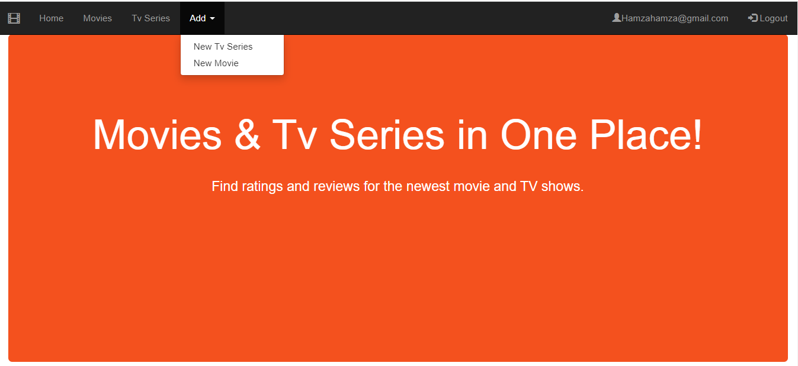
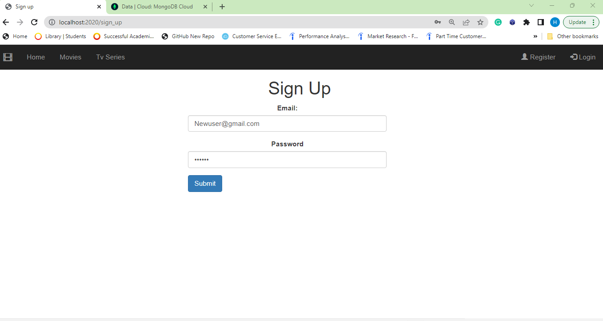
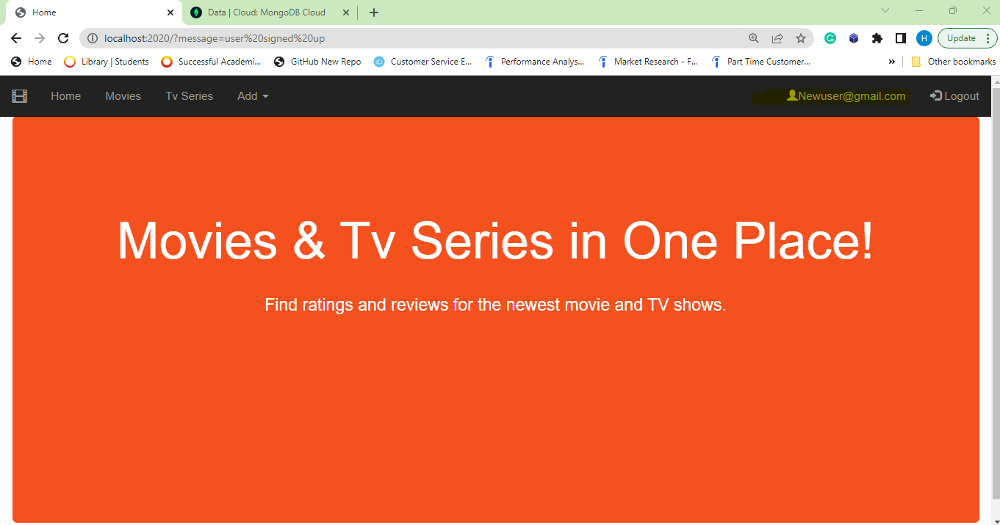
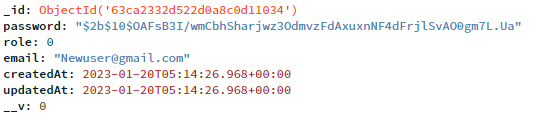
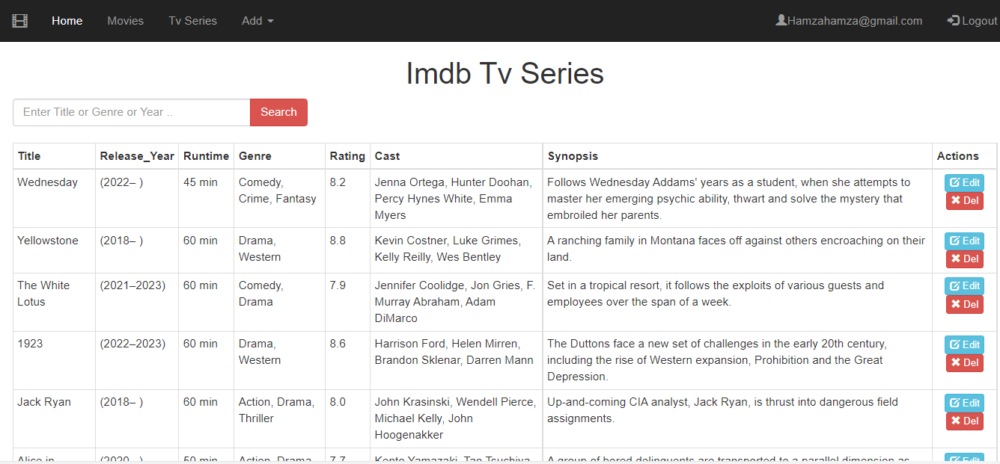
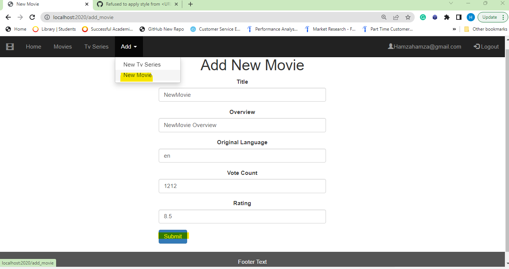
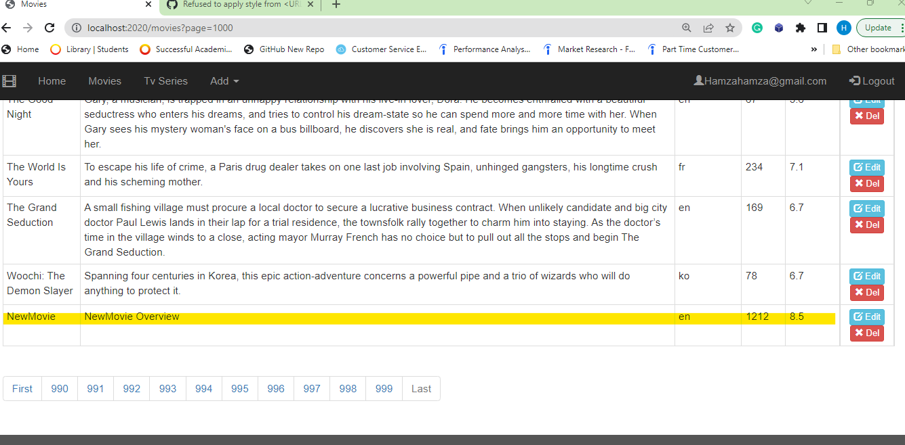
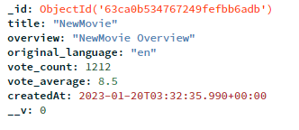

- [Title and Cover Page](#title-and-cover-page)
- [Introduction](#introduction)
- [System Overview](#system-overview)
  - [Briefly describing all datastores including databases, file systems and media data stores](#briefly-describing-all-datastores-including-databases-file-systems-and-media-data-stores)
  - [Key views and interfaces](#key-views-and-interfaces)
  - [Including a diagram of the key system components and how they are linked](#including-a-diagram-of-the-key-system-components-and-how-they-are-linked)
- [Key Design Decisions](#key-design-decisions)
- [Database Design](#database-design)
- [Security and Scalability](#security-and-scalability)
- [Conclusion and Reflection](#conclusion-and-reflection)

# Title and Cover Page

Note: it is vital that this information is displayed clearly on the cover page, failure to include this information may result in your work being returned to you unmarked.

Link to your hosted web application.
Link to Git Repository : https://github.com/HamzaMohibe/COM519_ImdbTvSeries

# Introduction

As a fan of movies and TV shows, I found myself wanting a way to easily discover new content and keep track of my favorites. I wanted to make it easier for people to find good content: With so many TV shows and movies available, it can be overwhelming to know what to watch. Building a website that recommends movies and TV series based on IMDb ratings could make it easier for people to find good content that they will enjoy in one place. This website displays data of more than 9000 tv series and 10000 movies with an interactive user interface and various features, such as searching and adding new rating to the website for registered users .

# System Overview

A high-level overview of how the system functions, you can use screen shots if it helps. You should consider aspects such as:

## Briefly describing all datastores including databases, file systems and media data stores

## Key views and interfaces

**Home page:**

- General User:

  This is the home page of the website, it is a welcome page with a navbar that contains limited functionalities for general user who can view and search for movies and TV series by using the appropriate views. They can also search the reviews of movies or tv series by accessing the reviews views where there is a search bar.

  

- Registered User:

  For a registered users, they can do everything that a general user can do, but they also have additional functionality to add new reviews for movies and tv series.

  

**Register:**

When a general user wants to register, he simply clicks the register button in the top left of the nav bar. A form need to be filled by the user with an email and password. A validation functionality is already implemented.



When the user registers, he is redirected directly to the home page logged in, for that, in the `controllers/user.js` a session is created when a new user is created for the first time, so he will not need to log in again after registration.

```
    ...
    await user.save();
    req.session.userID = user._id;
    ...
```



We can also see that the new user has been inserted in the database.



**Login:**

**Movies / Tv Series:**

"Example of Tv Series view" (Same functionality for movies)

- General / Registered User:

  This is a view where all tv series reviews are listed, along with a search bar where the user can enter any text, and the results will load in the same table (using api).

  

  - Search functionality:

    I am using API to render the database as JSON from MongoDB. I started by creating an API controller `controllers/api/serie.js` .

    ```
        const TvSeries = require("../../models/Serie");
        exports.list = async (req, res) => {
        const searchQuery = req.query.search;

        if (!searchQuery) {
            res.json([]);
        }

        try {
            const Result = await TvSeries.find(
            { $text: { $search: searchQuery } },
            { score: { $meta: "textScore" } }
            )
            .sort({ score: { $meta: "textScore" } })
            .limit(50);
            res.json(Result);
        } catch (error) {
            console.log(error);
            res.status(404).send({
            message: `could not perform search`,
            });
        }
        };

    ```

    For this search functionality, I didn't use a new view, I used the `views/series.ejs` to display the search result in the same table where all data are loaded. I linked a route to the new api controller function.

    ```
        const tvseriesApiController = require("./controllers/api/serie");
        ...
        app.get("/series", (req, res) => {
            res.render("series", tvseriesApiController);
        });
        app.get("/api/series", tvseriesApiController.list);

    ```

    As stated above, the search results will be injected in the same table of list of tv series in `views/series.ejs`

    ```
        <table class="table table-condensed table-bordered" id="tv_series">

    ```

    This code `public/search_tvseries.js` communicate with the api and inject the search results into the table with `id="tv_series" `.

    ```
        function show(data) {
        let tab = `    <thead>
                <tr>
                    <th>Title</th>
                    <th>Release_Year</th>
                    <th>Runtime</th>
                    <th>Genre</th>
                    <th>Rating</th>
                    <th>Cast</th>
                    <th>Synopsis</th>
                    </tr>
                    </thead>`;

        // Loop to access all rows
        data.forEach((serie) => {
            tab += `<tbody>
                <tr>
                    <td>${serie.Title}</td>
                    <td>${serie.Release_Year}</td>
                    <td>${serie.Runtime}</td>
                    <td>${serie.Genre}</td>
                    <td>${serie.Rating}</td>
                    <td>${serie.Cast}</td>
                    <td>${serie.Synopsis}</td>
                    </tr>
                    </tbdody>`;
        });
        // Setting innerHTML as tab variable
        document.getElementById("tv_series").innerHTML = tab;
        }


        const tvseriesSearch = async () => {
        const searchVal = document.getElementById("searchInput").value;
        try {
            const ref = await fetch(`/api/series/?search=${searchVal}`);
            var searchResults = await ref.json();
            console.log(searchResults);
            show(searchResults);
        } catch (e) {
            console.log(e);
            console.log("could not search api");
        }
        };

    ```

    Above, we first use the getElementById() to grab the search value that has been input, `const searchVal = document.getElementById("searchInput").value;`. We then go ahead and send a search request to our API `const ref = await fetch(`/api/series/?search=${searchVal}`);`. After that we call the show() function and we pass the result into a template that we created. The show(data) function loop through all rows in the data and add them to the body table, and finally, inject the whole tab in the table using `document.getElementById("tv_series").innerHTML = tab;`.

    **Note: Same implementation was applied on search movies.(See code)**

    This an example of the search functionality, if we put the word "bad" for example, it gives you all the tv series with the word "bad" in their titles, cast, synopsis.. without loading the page.

    

- Admin User:

  A user admin, can do everything that general/registered user can do, but they also have the ability to edit or delete a review for tv series/movie. You can see below that an admin user who is signed in, can perform actions such as edit or delete.

  ```
      <% if(user.role == 1) { %>
          <td class="text-center">
            <a
              href="/series/update/<%= serie._id %>"
              class="btn btn-info btn-xs"
              ><span class="glyphicon glyphicon-edit"></span> Edit</a
            >
            <a
              href="/series/delete/<%= serie._id %>"
              class="btn btn-danger btn-xs"
              ><span class="glyphicon glyphicon-remove"></span> Del</a
            >
          </td>
      <% } %>
  ```

  

  - Edit:

    The admin user can edit a review of tv series or movie. There is a validation for the form in case the user leaves some required inputs empty.

    

    Let's change the rating from 8.2 to 8.9:

    

    We can see here that it is updated in the table of tv series reviews for "Wednesday".

    

**Add a Tv series/Movie review:**

"Example of Adding a new movie review" (Same functionality for tv series)

- Admin / Registered User:

  An admin or registered user both can add new reviews by choosing from the dropdown button "Add" in the nav bar.

  Let's add a new movie to test. We fill the form with the movie details and we click submit.

  

  We can check in the list of movies view in the last page to see the new added movie.

  

  We can also see that the added movie has been inserted in the database.

  

## Including a diagram of the key system components and how they are linked

# Key Design Decisions

You should rationalise the choices you made in designing your application. This section could be broken down into the following sections:

# Database Design

This section will document the different database entities and how they are related.

# Security and Scalability

Identify in what ways your application is secure and scalable.

# Conclusion and Reflection

Bring the document to a close by tying together the process, and provide me with a brief reflective account of the entire project
