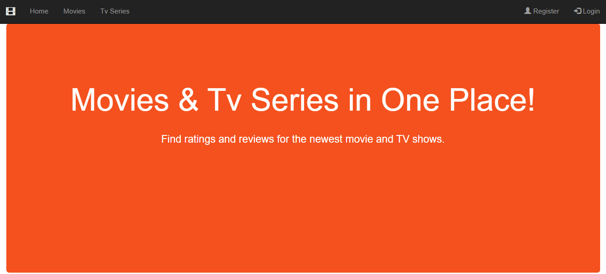
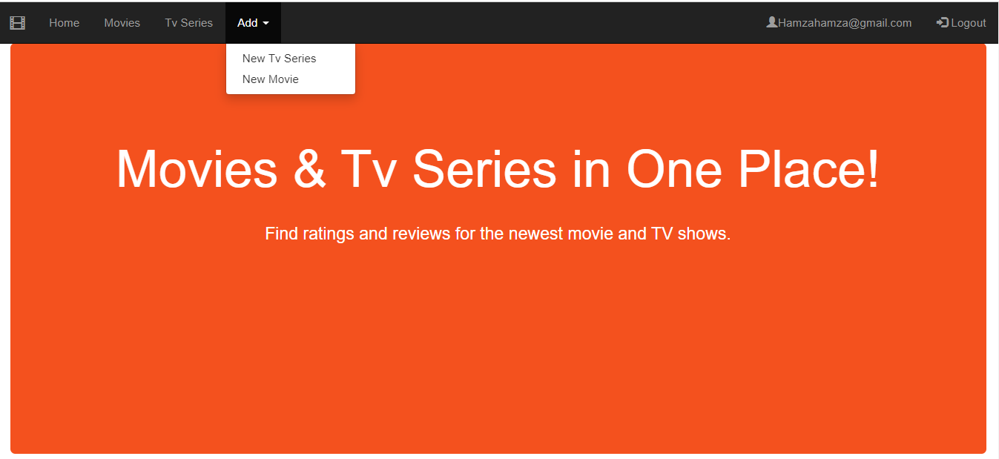
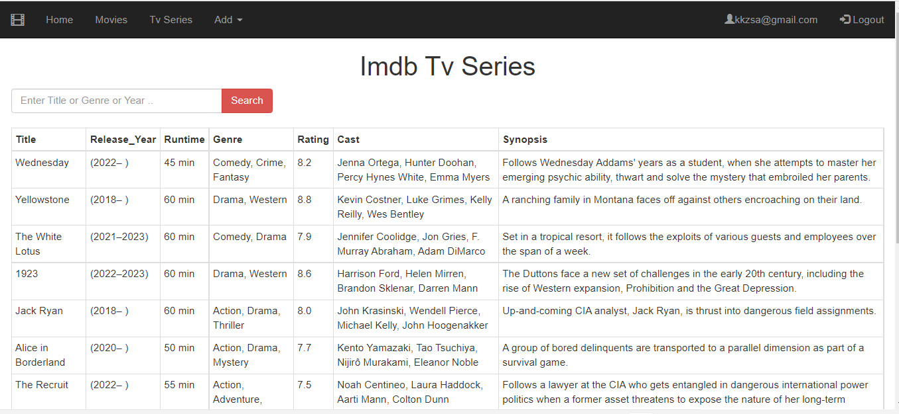
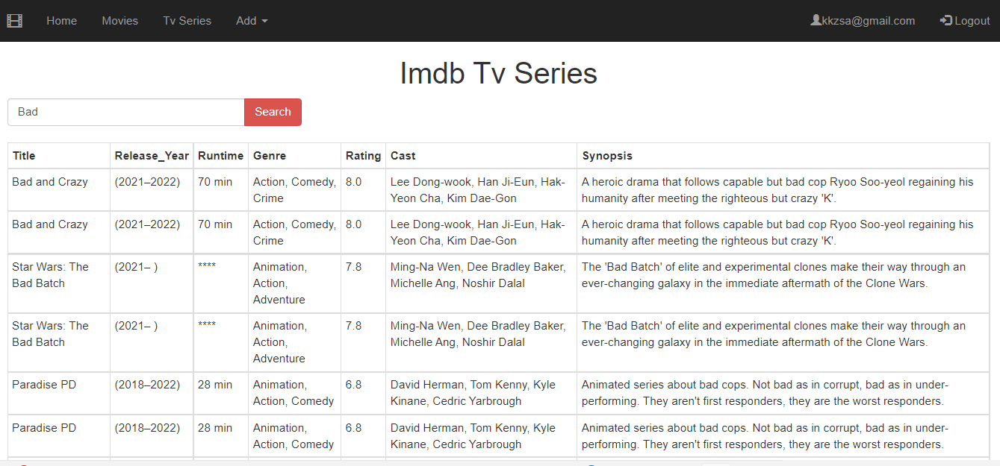
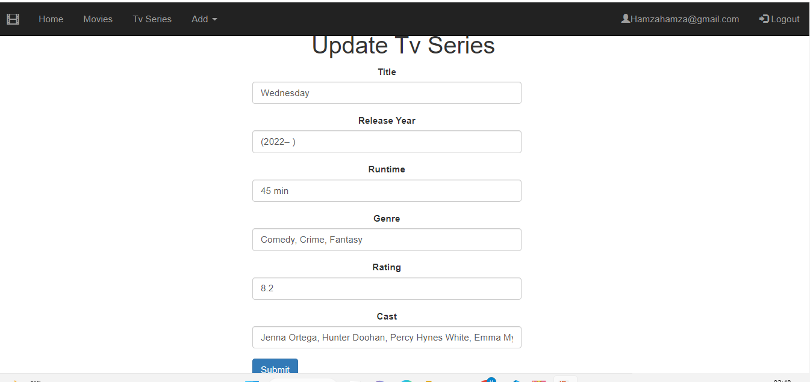
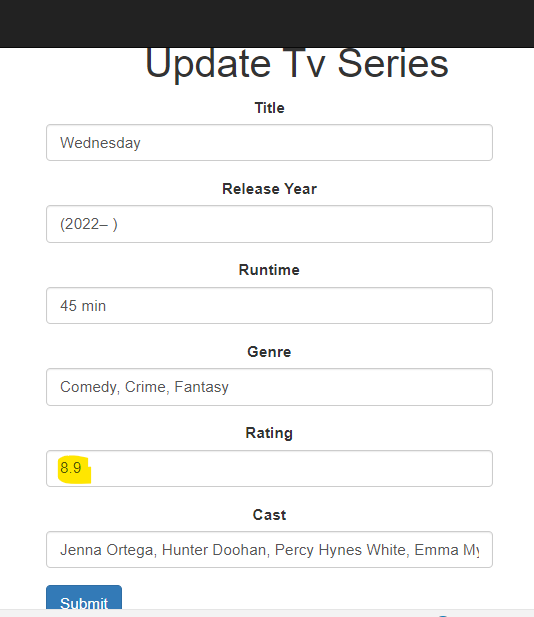
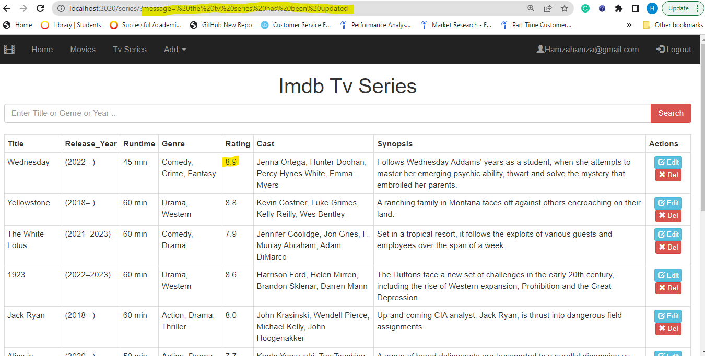

- [Title and Cover Page](#title-and-cover-page)
- [Introduction](#introduction)
- [System Overview](#system-overview)
- [Database Design](#database-design)
- [Security and Scalability](#security-and-scalability)
- [Conclusion and Reflection](#conclusion-and-reflection)

# Title and Cover Page

Note: it is vital that this information is displayed clearly on the cover page, failure to include this information may result in your work being returned to you unmarked.

Link to your hosted web application.
Link to Git Repository : https://github.com/HamzaMohibe/COM519_ImdbTvSeries

# Introduction

As a fan of movies and TV shows, I found myself wanting a way to easily discover new content and keep track of my favorites. I wanted to make it easier for people to find good content: With so many TV shows and movies available, it can be overwhelming to know what to watch. Building a website that recommends movies and TV series based on IMDb ratings could make it easier for people to find good content that they will enjoy in one place. This website displays data of more than 8000 tv series and 10000 movies with an interactive user interface and various features, such as searching and adding new rating to the website for registred users .

# System Overview

A high-level overview of how the system functions, you can use screen shots if it helps. You should consider aspects such as:

Briefly describing all datastores including databases, file systems and media data stores
Key views and interfaces
Including a diagram of the key system components and how they are linked
#Key Design Decisions
You should rationalise the choices you made in designing your application. This section could be broken down into the following sections:

**Home page**

- General User:

  This is the home page of the website, it is a welcome page with a navbar that contains limited functionalities for general user who can view and search for movies and TV series by using the appropriate views. They can also search the reviews of movies or tv series by accessing the reviews views where there is a search bar.
  

- Registred User:
  For a registered users, they can do everything that a general user can do, but they also have additional functionality to add new reviews for movies and tv series.
  

**Movies / Tv Series**
"Example of Tv Series view"

- General / Registred User:
  This is a view where all tv series reviews are listed, along with a search bar where the user can enter any text, and the results will load in the same table (using api).
  

  - Search functionality:
    This an example of the search functionality, if we put the word "bad" for example, it gives you all the series with the word"bad" in their title, cast, synopsis.. without loading the page.
    

- Admin User:
  A user admin, can do everything that general/registred user can do, but they also have the ability to edit or delete a review for tv series/movie. You can see below that an admin user who is signed in, can perform actions such as edit or delete.
  
  - Edit:
    The admin user can edit a review of tv series or movie. There is a validation for the form in case the user leaves some required inputs empty.
    
    Let's change the rating from 8.2 to 8.9:
    
    We can see here that it is updated in the table of tv series reviews for "Wednesday".
    

# Database Design

This section will document the different database entities and how they are related.

# Security and Scalability

Identify in what ways your application is secure and scalable.

# Conclusion and Reflection

Bring the document to a close by tying together the process, and provide me with a brief reflective account of the entire project
