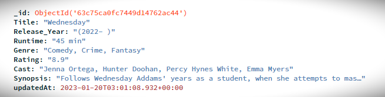
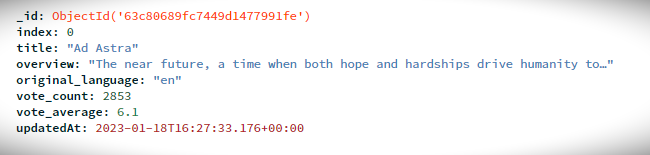
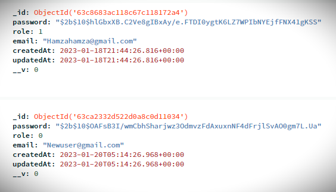
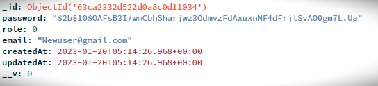
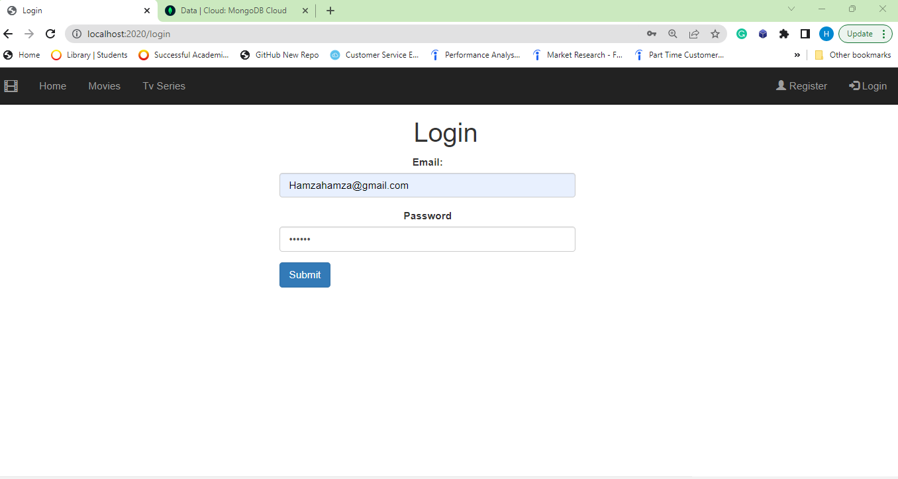
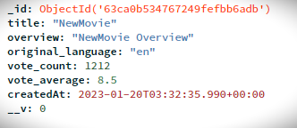

- [COM519\_ImdbTvSeries\&Movies](#com519_imdbtvseriesmovies)
  - [Setup](#setup)
- [Introduction](#introduction)
- [System Overview](#system-overview)
  - [Briefly describing all datastores including databases, file systems and media data stores](#briefly-describing-all-datastores-including-databases-file-systems-and-media-data-stores)
  - [Diagram MVC Stack](#diagram-mvc-stack)
  - [Key views and interfaces](#key-views-and-interfaces)
- [Conclusion and Reflection](#conclusion-and-reflection)

# COM519_ImdbTvSeries&Movies

Link to Git Repository : https://github.com/HamzaMohibe/COM519_ImdbTvSeries

## Setup

- Clone the repository
- Install Dependencies -
  `npm install`
- Run the project in development mode -
  `npm run dev`
- Visit localhost:2020

# Introduction

As a fan of movies and TV shows, I found myself wanting a way to easily discover new content and keep track of my favorites. I wanted to make it easier for people to find good content: With so many TV shows and movies available, it can be overwhelming to know what to watch. Building a website that recommends movies and TV series based on IMDb ratings could make it easier for people to find good content that they will enjoy in one place. This website displays data of more than 9000 tv series and 10000 movies with an interactive user interface and various features, such as searching and adding new rating to the website for registered users .

# System Overview

This is a CRUD application (Create, Read, Update, and Delete) which is a common pattern for building web applications, and it was applied to this website for recommending TV series and movies with their ratings from IMDb.

**Create:** This operation would allow users to add new reviews for movies and TV series. This could be done by a registered user via a form on the website that allows them to submit a review, rating, and other information. The controller would then take the input, validate it and create a new review by adding it to the database.

**Read:** This operation would allow all users (registered or not) to view information about movies and TV series, including their ratings and reviews. This could be done by using views to display the data from the models. Users could search and filter the information to find specific movies or TV series using API.

**Update:** This operation would allow users to edit existing reviews. This could be done only by a an admin user via a form on the website that allows them to edit a review, rating and other information. The controller would then take the input, validate it and update the review in the database.

**Delete:** This operation would allow users to delete existing reviews. This could be done by an admin user via a button on the website that allows them to delete the review.

The CRUD functionality for the reviews is the main functionality of the website, in addition to that, the website has also user authentification and user roles (registered user & admin). As explained above, only admin can edit and delete.

Overall, implementing CRUD functionality for the reviews was an important part of building the website, as it allows users to contribute their own reviews and ratings, and make the website more dynamic and engaging.

## Briefly describing all datastores including databases, file systems and media data stores

For this application, I used MongoDB Atlas is a cloud-based NoSQL database service that allows me to store and query data in a non-relational format. Using MongoDB Atlas for this website was a good choice as it allows for high scalability and performance.

The database have three collections:

**tvseries:** this collection would store data about TV series, such as the title, release date, cast, IMDb rating and more.



**movies:** this collection would store data about movies, such as the title, vote count, IMDb rating and more.



**users:** this collection would store data about users, such as their email, password and their role (0 if user / 1 if admin). Here I set manually an admin role for a user for testing purposes `{role : 1 }`, because when a user register to the website for the first time, by default, he got the role of a normal user.

```
...
    const userSchema = new Schema(
    {
        password: { type: String, required: [true, "password is required"] },
        role: { type: Number, default: 0 },
        email: {
        type: String,
        required: [true, "email is required"],
        unique: true,
        },
    },
    { timestamps: true }
    );
...
```



Each collection would store the data in a format known as a document, which is a JSON-like structure that can include fields of various data types, such as strings, integers, and arrays.

MongoDB Atlas allows you to easily create and manage indexes on your collections, which can improve the performance of your queries. You can also use MongoDB's powerful query language, the MongoDB Query Language (MQL), to query and filter the data in your collections.

Additionally, MongoDB Atlas has built-in security features such as role-based access controls, and it provides automatic backups and disaster recovery options. This can help ensure that your data is safe and secure.

By using MongoDB Atlas as the database for your website, you can take advantage of its scalability, performance, and rich query capabilities to build a dynamic and engaging website for recommending TV series and movies with their ratings from IMDb.

## Diagram MVC Stack


## Key views and interfaces

**Home page:**

- General User:

  This is the home page of the website, it is a welcome page with a navbar that contains limited functionalities for general user who can view and search for movies and TV series by using the appropriate views. They can also search the reviews of movies or tv series by accessing the reviews views where there is a search bar.

  

- Registered User:

  For a registered users, they can do everything that a general user can do, but they also have additional functionality to add new reviews for movies and tv series.

  ```
  <% if(user) { %>
        <li class="dropdown">
          <a class="dropdown-toggle" data-toggle="dropdown" href="#"
            >Add <span class="caret"></span
          ></a>
          <ul class="dropdown-menu">
            <li><a href="../add_tvseries">New Tv Series</a></li>
            <li><a href="../add_movie">New Movie</a></li>
          </ul>
        </li>
        <% } %>

  ```

  

**Register:**

When a general user wants to register, he simply clicks the register button in the top left of the nav bar. A form need to be filled by the user with an email and password. A validation functionality is already implemented.


When the user registers, he is redirected directly to the home page logged in, for that, in the `controllers/user.js` a session is created when a new user is created for the first time, so he will not need to log in again after registration.

```
    ...
    await user.save();
    req.session.userID = user._id;
    ...
```


We can also see that the new user has been inserted in the database.



**Login:**

A current user can log-in to the application to gain access to some other features such as add reviews of movies and tv series to the website or delete them if he is an admin user. It would only allow a user to log-in if user email and password matched up with the user collection.



**Movies / Tv Series:**

"Example of Tv Series view" (Same functionality for movies)

- General / Registered User:

  This is a view where all tv series reviews are listed, along with a search bar where the user can enter any text, and the results will load in the same table (using api).

  

  - Search functionality:

    I am using API to render the database as JSON from MongoDB. I started by creating an API controller `controllers/api/serie.js` .

    ```
        const TvSeries = require("../../models/Serie");
        exports.list = async (req, res) => {
        const searchQuery = req.query.search;

        if (!searchQuery) {
            res.json([]);
        }

        try {
            const Result = await TvSeries.find(
            { $text: { $search: searchQuery } },
            { score: { $meta: "textScore" } }
            )
            .sort({ score: { $meta: "textScore" } })
            .limit(50);
            res.json(Result);
        } catch (error) {
            console.log(error);
            res.status(404).send({
            message: `could not perform search`,
            });
        }
        };

    ```

    For this search functionality, I didn't use a new view, I used the `views/series.ejs` to display the search result in the same table where all data are loaded. I linked a route to the new api controller function.

    ```
        const tvseriesApiController = require("./controllers/api/serie");
        ...
        app.get("/series", (req, res) => {
            res.render("series", tvseriesApiController);
        });
        app.get("/api/series", tvseriesApiController.list);

    ```

    As stated above, the search results will be injected in the same table of list of tv series in `views/series.ejs`

    ```
        <table class="table table-condensed table-bordered" id="tv_series">

    ```

    This code `public/search_tvseries.js` communicate with the api and inject the search results into the table with `id="tv_series" `.

    ```
        function show(data) {
        let tab = `    <thead>
                <tr>
                    <th>Title</th>
                    <th>Release_Year</th>
                    <th>Runtime</th>
                    <th>Genre</th>
                    <th>Rating</th>
                    <th>Cast</th>
                    <th>Synopsis</th>
                    </tr>
                    </thead>`;

        // Loop to access all rows
        data.forEach((serie) => {
            tab += `<tbody>
                <tr>
                    <td>${serie.Title}</td>
                    <td>${serie.Release_Year}</td>
                    <td>${serie.Runtime}</td>
                    <td>${serie.Genre}</td>
                    <td>${serie.Rating}</td>
                    <td>${serie.Cast}</td>
                    <td>${serie.Synopsis}</td>
                    </tr>
                    </tbdody>`;
        });
        // Setting innerHTML as tab variable
        document.getElementById("tv_series").innerHTML = tab;
        }


        const tvseriesSearch = async () => {
        const searchVal = document.getElementById("searchInput").value;
        try {
            const ref = await fetch(`/api/series/?search=${searchVal}`);
            var searchResults = await ref.json();
            console.log(searchResults);
            show(searchResults);
        } catch (e) {
            console.log(e);
            console.log("could not search api");
        }
        };

    ```

    Above, we first use the getElementById() to grab the search value that has been input, `const searchVal = document.getElementById("searchInput").value;`. We then go ahead and send a search request to our API `const ref = await fetch(`/api/series/?search=${searchVal}`);`. After that we call the show() function and we pass the result into a template that we created. The show(data) function loop through all rows in the data and add them to the body table, and finally, inject the whole tab in the table using `document.getElementById("tv_series").innerHTML = tab;`.

    **Note: Same implementation was applied on search movies.(See code)**

    This an example of the search functionality, if we put the word "bad" for example, it gives you all the tv series with the word "bad" in their titles, cast, synopsis.. without loading the page.

    

- Admin User:

  A user admin, can do everything that general/registered user can do, but they also have the ability to edit or delete a review for tv series/movie. You can see below that an admin user who is signed in, can perform actions such as edit or delete.

  ```
      <% if(user.role == 1) { %>
          <td class="text-center">
            <a
              href="/series/update/<%= serie._id %>"
              class="btn btn-info btn-xs"
              ><span class="glyphicon glyphicon-edit"></span> Edit</a
            >
            <a
              href="/series/delete/<%= serie._id %>"
              class="btn btn-danger btn-xs"
              ><span class="glyphicon glyphicon-remove"></span> Del</a
            >
          </td>
      <% } %>
  ```

  

  - Edit:

    The admin user can edit a review of tv series or movie. There is a validation for the form in case the user leaves some required inputs empty.

    

    Let's change the rating from 8.2 to 8.9:

    

    We can see here that it is updated in the table of tv series reviews for "Wednesday".

    

**Add a Tv series/Movie review:**

"Example of Adding a new movie review" (Same functionality for tv series)

- Admin / Registered User:

  An admin or registered user both can add new reviews by choosing from the dropdown button "Add" in the nav bar.

  Let's add a new movie to test. We fill the form with the movie details and we click submit.

  

  We can check in the list of movies view in the last page to see the new added movie.

  

  We can also see that the added movie has been inserted in the database.

  

# Conclusion and Reflection

Overall, I have been able to successfully build a website for recommending TV series and movies with their ratings from IMDb. I've implemented CRUD functionality for reviews, as well as authentication to allow users to add new reviews. However, I was unable to deploy the application due to a cyclic dependency issue.

As for the next step, I am planning to keep working on this project by adding the functionality for the admin to view a list of users, edit their details, and set roles. It will give the admin more control over the website and its users. This can be done by adding views, controllers, and the appropriate functionality for the admin to manage the users. In addition, I will try to add the functionality to upload pictures for movies and Tv series.
All in all, building this website was a great experience and I am happy with the outcome.
